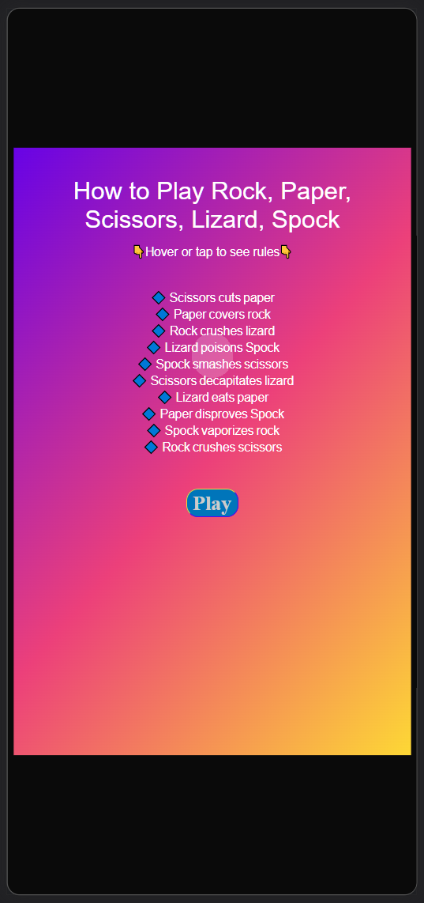

# Rock, Paper, Scissors, Lizard, Spock

## UX

### Colour Scheme

-  #White used for primary text.
-  Linear gradient of #5F00EA 0%, #EC407A 50%, #FDD835 100% used for background

### Typography

- 
## User Stories

### Site Users

- As a new site user, I would like to learn the rules of the game so I understand how to play.
- As a new site user, I would like to be able to access the game quickly .
- As a new site user, I would like to be able to see my score and that of the computer opponent.
- As a new site user, I would like to be able to reset my game and start again.

## Wireframes

### Home Page Wireframes

| Size | Screenshot |
| --- | --- |
| Mobile |  |

### Game Page Wireframes

| Size | Screenshot |
| --- | --- |
| Mobile |  |

## Features

### Existing Features

- **Home Page**

    - A welcoming home page that presents the user with a simple, but clear explanation of the rules of the game & a link/button to begin playing.

- **Game Page**
	
    - A page for the main game with a button for each choice the player can take and a 
    

    

- **Bodyweight Exercises Page**
	
    -
    

- ****
	
    -
    

### Future Features

## Tools & Technologies Used

- [Git](https://git-scm.com) used for version control. (`git add`, `git commit`, `git push`)
- [GitHub](https://github.com) used for secure online code storage.
- [GitHub Pages](https://pages.github.com) used for hosting the deployed front-end site.
- [Gitpod](https://gitpod.io) used as a cloud-based IDE for development.

# Testing

## Code Validation
- https://validator.w3.org/nu/

## Responsiveness
- Website performed normally on mobile, desktop and tablet:

- Lighthouse
 
 
 
 
## Deployment

The site was deployed to GitHub Pages. The steps to deploy are as follows:
- In the [GitHub repository](https://github.com/tadhgnolan/Rock-Paper-Scissors-Lizard-Spock), navigate to the Settings tab 
- From the source section drop-down menu, select the **Main** Branch, then click "Save".
- The page will be automatically refreshed with a detailed ribbon display to indicate the successful deployment.

The live link can be found [here](https://github.com/tadhgnolan/Rock-Paper-Scissors-Lizard-Spock)

### Local Deployment

This project can be cloned or forked in order to make a local copy on your own system.

#### Cloning

You can clone the repository by following these steps:

1. Go to the [GitHub repository](https://github.com/tadhgnolan/Rock-Paper-Scissors-Lizard-Spock) 
2. Locate the Code button above the list of files and click it 
3. Select if you prefer to clone using HTTPS, SSH, or GitHub CLI and click the copy button to copy the URL to your clipboard
4. Open Git Bash or Terminal
5. Change the current working directory to the one where you want the cloned directory
6. In your IDE Terminal, type the following command to clone my repository:
	- `git clone https://github.com/tadhgnolan/Rock-Paper-Scissors-Lizard-Spock.git`
7. Press Enter to create your local clone.

Alternatively, if using Gitpod, you can click below to create your own workspace using this repository.

Please note that in order to directly open the project in Gitpod, you need to have the browser extension installed.
A tutorial on how to do that can be found [here](https://www.gitpod.io/docs/configure/user-settings/browser-extension).

#### Forking

By forking the GitHub Repository, we make a copy of the original repository on our GitHub account to view and/or make changes without affecting the original owner's repository.
You can fork this repository by using the following steps:

1. Log in to GitHub and locate the [GitHub Repository](https://github.com/tadhgnolan/Rock-Paper-Scissors-Lizard-Spock)
2. At the top of the Repository (not top of page) just above the "Settings" Button on the menu, locate the "Fork" Button.
3. Once clicked, you should now have a copy of the original repository in your own GitHub account!

## Credits

### Content

| Source | Location | Notes |
| --- | --- | --- |
| 
| [REM to PX Converter](https://pixelsconverter.com/rem-to-px) | entire site | used to convert pixel values to REM values |
| [Shreya Bose](https://www.browserstack.com/guide/ideal-screen-sizes-for-responsive-design) | media queries | referenced when trying to decide best values for responsive design |
| [Am I Responsive](https://ui.dev/amiresponsive?) | documentation | used to generate a mockup of website on multiple devices for documentation |
| [Rachel Cravit](https://venngage.com/blog/color-blind-friendly-palette/) | selecting colors | was helpful in choosing color palette |
| [Rapid Tables](https://www.rapidtables.com/convert/color/index.html) | entire site | used when converting colors to hex |

### Acknowledgements

- I would like to thank my brother Cormac, for his help and mentorship through this project.

- I would like to thank my mentor, Tim Nelson for his help throughout.

- I would like to thank the [Code Institute Slack community](https://code-institute-room.slack.com) for the moral support; it kept me going during periods of self doubt and imposter syndrome.